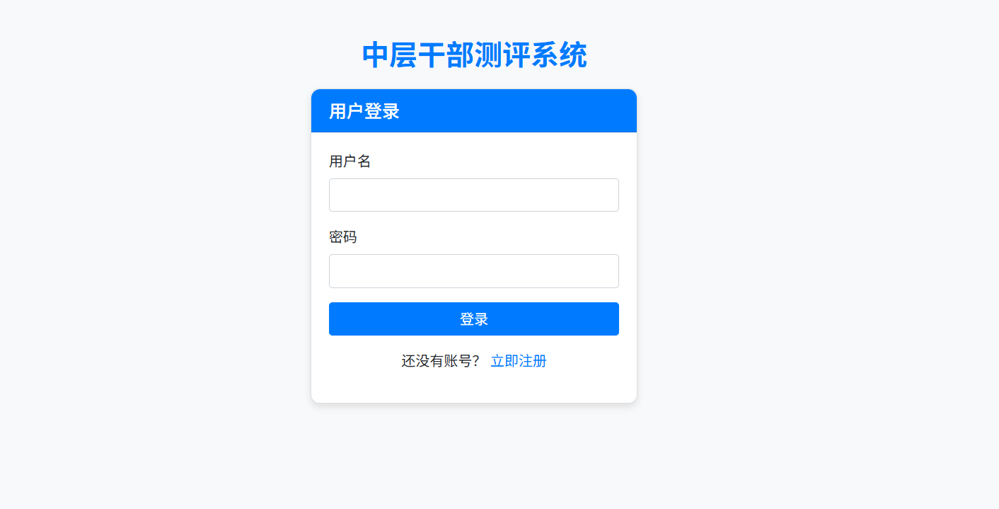
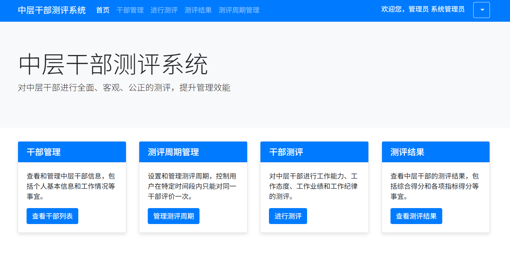
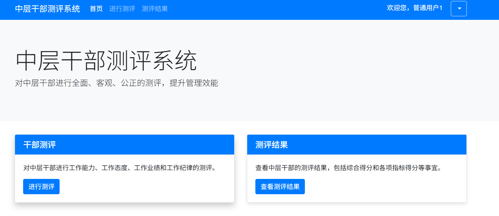

# 中层干部测评系统

## 项目简介
这是一个针对组织中层干部进行综合测评的系统，基于Spring Boot和Thymeleaf开发。系统实现了干部评价的完整流程，包括用户管理、干部信息管理、评价标准管理、评价提交与结果统计等功能。

## 主要功能
- 用户管理：包括管理员和普通用户角色区分
- 干部信息管理：添加、编辑、删除中层干部信息
- 评价标准管理：设置"德能勤绩廉"五个维度的评价标准
- 评价提交：用户可对干部进行评价并提交评语
- 结果统计：自动计算各维度得分和综合得分，支持查看统计结果和评语
- 评价周期管理：支持多个评价周期的管理

## 技术栈
- 后端：Spring Boot、Spring Data JPA、Spring Security
- 前端：Thymeleaf、Bootstrap、jQuery、Chart.js
- 数据库：MySQL
- 构建工具：Maven

## 系统运行示例

### 通用功能
#### 登录界面


### 管理员端功能
#### 系统控制台


#### 干部管理


#### 用户管理


#### 评价标准管理


#### 测评结果汇总


#### 评价详情查看


### 用户端功能
#### 用户首页


#### 待评价干部列表


#### 评价表单填写


#### 个人评价历史


#### 查看个人评价详情


## 安装与运行
1. 克隆项目到本地
   ```
   git clone https://github.com/你的用户名/干部测评系统.git
   ```

2. 配置数据库
   - 创建MySQL数据库
   - 修改`application.properties`中的数据库连接配置

3. 使用Maven构建项目
   ```
   mvn clean package
   ```

4. 运行项目
   ```
   java -jar target/demo-0.0.1-SNAPSHOT.jar
   ```

5. 浏览器访问
   ```
   http://localhost:8080
   ```

## 系统特点
- 采用"德能勤绩廉"五个维度进行全面评价
- 支持管理员和普通用户两种角色，权限分明
- 自动计算评价平均分，支持特定权重设置
- 评价结果可视化展示
- 管理员可查看所有评价数据和统计信息
- 普通用户可提交评价并查看个人评价历史
- 评价人匿名性保护

## 贡献方式
欢迎提交Issue和Pull Request来完善本项目。

## 许可证
[MIT License](LICENSE) 